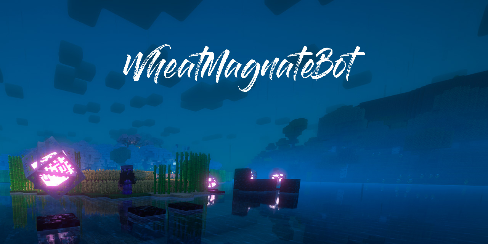

# WheatMagnateBot

Lightweight Minecraft bot built with mineflayer. Monitors hunger, scans nearby players, and sends Discord webhook notifications for important events. Designed to run on Windows with Node.js.

## Features
- Auto-login to a configured Minecraft server (Microsoft auth supported).
- Discord webhook notifications for: login, spawn, disconnect, errors, kicked (with proper reason display), death, low/no food, and player enter/leave.
- Food monitor:
  - Detects common food items in inventory (bread, apple, beef, golden_carrot).
  - Auto-eats when hunger drops below a threshold (bot.food < 18).
  - Sends a Discord alert when no food is present.
- Nearby player scanner:
  - Detects players within 300 blocks using bot.entities and distance checks.
  - Sends enter/leave notifications.
  - Supports an `ignoredUsernames` list.
- Graceful reconnect and pause controls:
  - Automatic reconnect on disconnect unless paused.
  - Smart handling during server restarts: detects daily restart at 9 AM Kyiv time and waits 5 minutes before reconnecting to avoid notification spam.
  - In-game chat commands (authorized user) for restart and pause.
- Safe interval management: clears monitoring intervals on spawn and on disconnect to prevent duplicates.
- Environment switch to disable startup (DISABLE_BOT=true).

## Requirements
- Node.js (14+ recommended)
- npm
- A Minecraft account (Microsoft) if using `auth: 'microsoft'`

## Dependencies
- mineflayer
- axios

Install:
```powershell
npm install mineflayer axios
```

## Configuration
Edit `bot.js`:
- `config.host` — server hostname (default: `oldfag.org`)
- `config.username` — bot account username (default: `WheatMagnate`)
- `config.auth` — authentication method (e.g., `'microsoft'`)
- `ignoredUsernames` — array of usernames to ignore
- `reconnectTimeout` — milliseconds before reconnect on disconnect (default: 15000)

Environment variables:
- `DISCORD_WEBHOOK_URL` — Discord webhook URL (required for notifications)
- `DISABLE_BOT=true` — prevents the bot from starting.

## In-Game Chat Commands
Only messages from the authorized username (`bdiev_` by default) are processed:
- `!restart` — bot quits and reconnects.
- `!pause` — pause for 10 minutes (bot quits and reconnects after 10 minutes).
- `!pause <minutes>` — pause for a custom number of minutes.

## Behavior Notes
- Food detection uses substring matching in item names.
- Eating is handled via `bot.equip()` and `bot.consume()`.
- Player scanning runs on a 1s interval and tracks enter/leave events with a Set.
- Interval timers are cleared on spawn and end to avoid multiple active timers.
- Kick reason is properly displayed: if an object, it's JSON stringified; if a string, shown as-is.
- During server restarts (detected at 9 AM Kyiv time), reconnection waits 5 minutes instead of 15 seconds to prevent notification spam.

## Running the Bot (Windows)
1. Install Node.js and dependencies:
   ```powershell
   npm install
   npm install mineflayer axios
   ```
2. Set the Discord webhook URL environment variable and start the bot:
   ```powershell
   set DISCORD_WEBHOOK_URL=your_webhook_url_here
   node bot.js
   ```
   Or in one command:
   ```powershell
   set DISCORD_WEBHOOK_URL=your_webhook_url_here && node bot.js
   ```

## Troubleshooting
- If Discord webhooks fail, verify `DISCORD_WEBHOOK_URL` and network access.
- If Microsoft login fails, check cached credentials and follow mineflayer auth docs.
- Check console logs for runtime errors and webhook messages for critical events.

## Security & Privacy
- The Discord webhook URL is set via environment variable to prevent exposure in source code.
- Do not commit account credentials to source control.

## License
Choose and add a license file (e.g., MIT) before publishing the repository.